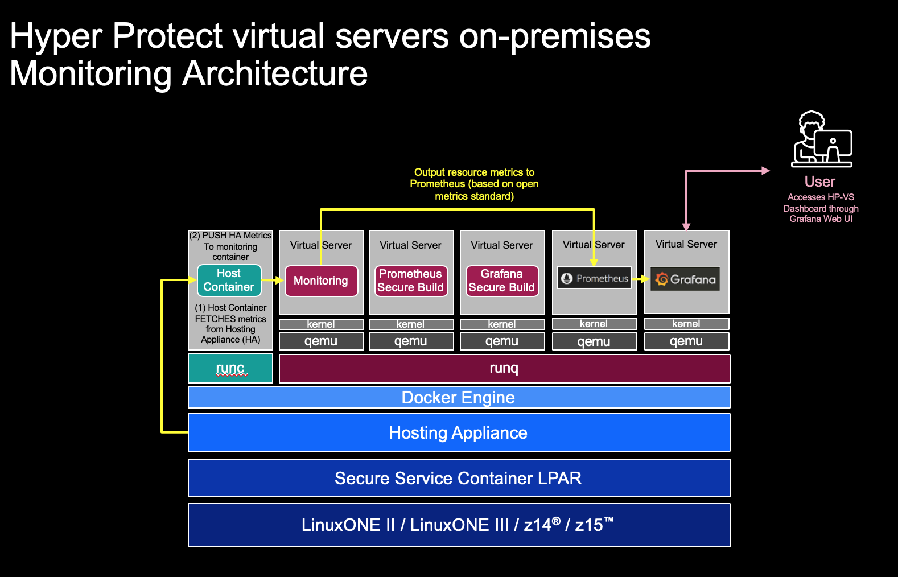

# Hyper Protect Virtual Servers Monitoring Setup

This repo documents one monitoring tooling implementation for the Hyper Protect Virtual Servers V1.2.1 on premises offering. For official product documentation please refer to [the product knowledge center](https://www.ibm.com/support/knowledgecenter/SSHPMH_1.2.x/topics/hpvs121.html).

By following this tech doc, you will learn how to build and deploy your own Prometheus and Grafana Virtual Servers to be run inside a Hyper Protect Virtual Servers appliance. Additionally, you will import a Hyper Protect Virtual Servers community Grafana dashboard that you can use to monitor your Hyper Protect Virtual Servers appliance.

Hyper Protect Virtual Servers V1.2.1 ships with the collectd and monitoring images. The Hyper Protect Virtual Servers appliance admin then sets up the `collectd-exporter` following [the knowledge center](https://www.ibm.com/support/knowledgecenter/SSHPMH_1.2.x/topics/create_mc.html). 

The expectation is that the monitoring admin consumes the monitoring metrics generated by the Hyper Protect Virtual Servers `collectd-exporter` endpoint into their own monitoring tool(s). This repository documents the process to build and deploy your own Prometheus and Grafana Virtual Servers through the Hyper Protect Virtual Servers Secure Build and deploy process.

An alternative deployment pattern is if you already have an enterprise Grafana service, you can certainly choose to deploy only the Prometheus piece inside your hosting appliance, and add it as another Prometheus data source on your existing Grafana service.




This document assumes that you have already completed the following steps:
1. Installed Hyper Protect Virtual Servers 1.2.1
2. Setup the collectd and monitoring containers in your hosting appliance. Refer to the [knowledge center](https://www.ibm.com/support/knowledgecenter/SSHPMH_1.2.x/topics/create_mc.html) for detailed instructions on how to do this.

The general steps are:
1. Create your own private Github repo for your Prometheus build with the necessary keys and information
2. Go through the Secure Build process to build your Prometheus image
3. Register your Prometheus image with your hosting appliance
4. Deploy and test your Prometheus Virtual Server
5. Go through the Secure Build process to build your Grafana image
6. Register your Grafana image with your hosting appliance
7. Deploy and test your Grafana Virtual Server
8. Import the Hyper Protect Virtual Servers community Grafana Dashboard and customize static properties to reflect your hosting appliance allocations

Let's get started!

## Get necessary information of your Hyper Protect Virtual Servers monitoring service and test connecting to the service

You'll need the following from your Hyper Protect Virtual Servers appliance administrator:

1. The `collectd-exporter` endpoint hostname. i.e. `collectdhost-first.yourcompany.com` and port number (it is 8443 by default)
2. The client key, client certificate, and the CA certificate used to sign the server and client certificates during the creation of the Hyper Protect Virtual Servers collectd and monitoring service

You can test the validity of the credentials given to you, by running a simple `wget` against the `collectd-exporter` using those certificates and key and see if you get a successful result. If you do not and get a "Connection refused", then go back and ask for the right certificates, or make sure that the `collectd-exporter` is indeed running.

Here's an example of how to do a simple test:

This example assumes that the monitoring service hostname is `collectdhost-first.example.com` and listening on the default port of `8443`. From the system that you intend to run `wget`, make an entry in the `/etc/hosts` file with `collectdhost-first.example.com` for the Hyper Protect Virtual Servers server IP(LPAR IP).

Then run the following to ensure that you can reach the `collectd-exporter` with the certificates and key you were given:

```
$ wget https://collectdhost-first.example.com:8443/metrics --ca-certificate=myrootCA.crt --certificate=client-certificate.crt --private-key=client.key
```

Upon successful execution, you will see output similar to the following:

```
--2020-07-24 17:59:57--  https://collectdhost-first.example.com:8443/metrics
Resolving collectdhost-first.example.com (collectdhost-first.example.com)... 192.168.22.80
Connecting to collectdhost-first.example.com (collectdhost-first.example.com)|192.168.22.80|:8443... connected.
HTTP request sent, awaiting response... 200 OK
Length: 8680 (8.5K) [text/plain]
Saving to: ‘metrics’

metrics                                  100%[================================================================================>]   8.48K  --.-KB/s    in 0.03s

2020-07-24 17:59:57 (318 KB/s) - ‘metrics’ saved [8680/8680]
```

A file called `metrics` is saved to the directory you ran the `wget` from. This file contains Hyper Protect Virtual Servers appliance metrics.

## Clone this repo and edit configuration files to match your Hyper Protect Virtual Servers settings

Now clone this repo and change into repo directory:

```
$ git clone https://github.com/jinvanstee/hyper-protect-virtual-servers-monitoring.git

$ cd hyper-protect-virtual-servers-monitoring/
```

Modify the `hosts` file with IP address of your hosting appliance and the `collectd-exporter` endpoint hostname.

```
$ export HPVS_IP=<your Hyper Protect Virtual Servers appliance IP address>

$ export COLLECTD_HOSTNAME=<collectdhost-first.yourcompany.com>

$ cat > "hosts" <<EOF
$HPVS_IP $COLLECTD_HOSTNAME
EOF
```

Next, copy the `client.key`, `client-certificate.crt`, and `myrootCA.crt` files given to you by your Hyper Protect Virtual Servers appliance admin into the `keys` directory, so that your keys directory should contain the following:

```
$ mkdir keys

$ ls keys
client.key            client-certificate.crt myrootCA.crt
```

Note: you might need to rename the certificate and key files to match the names above. This way you don't have to modify the Prometheus configuration file, `prometheus.yml`. If you choose to retain the original names of your certificates and key, then you have to modify `prometheus.yml` to reflect those names.

Next, replace the hostname in `prometheus.yml` with the collectd hostname of your service. From the same terminal where you set the `COLLECTD_HOSTNAME` environment variable above, run the following:

```
$ sed -i '' 's/collectdhost-first.example.com/'${COLLECTD_HOSTNAME}'/g' prometheus.yml
```

The `prometheus.yml` file is the configuration file for your Prometheus service. Below is the `prometheus.yml` in this repo. You may choose update any other setting in the configuration file you wish before building the service. Once you build the Prometheus image with these configuration settings, if you want to change any of the configuration settings after it has been built, you will have to go through another Secure Build to produce a new release of the image.

```
global:
  scrape_interval: 10s
scrape_configs:
  - job_name: 'prometheus'
    static_configs:
            - targets: ['collectdhost-first.example.com:8443']
    scheme: https
    tls_config:
        ca_file: /etc/prometheus/keys/myrootCA.crt
        cert_file: /etc/prometheus/keys/client-certificate.crt
        key_file:  /etc/prometheus/keys/client.key
        server_name: collectdhost-first.example.com
```

Now you are ready to create your own private GitHub repo with these files. Note: only a private GitHub repo is recommended here because you will be pushing a private key to a GitHub repo and it is not recommended to do so in a public GitHub repo.

## Create your own private GitHub repo

Use GitHub to create a <b>private</b> repo either in an organization you have write access to or in your own GitHub account. In the following examples, I've created a private repo called `hpvsprometheus` in my own GitHub account.

From the `hyper-protect-virtual-servers-monitoring` main directory, add your private repo as a new remote. I named my remove `private` to denote that this is a private repo. You can call it whatever you want.

```
$ git remote add private <git@github.com:jinvanstee/hpvsprometheus.git>
```

Add and commit the customizations you made and the keys you added.

```
$ git add .

$ git commit -m "added hosting appliance specific config and keys"
[master 354e5f7] added hosting appliance specific config
 5 files changed, 197 insertions(+), 3 deletions(-)
 create mode 100644 keys/client-certificate.crt
 create mode 100644 keys/client.key
 create mode 100644 keys/myrootCA.crt
```

Now, push to your private repo:

```
$ git push -u private master
Counting objects: 41, done.
Delta compression using up to 8 threads.
Compressing objects: 100% (33/33), done.
Writing objects: 100% (41/41), 166.15 KiB | 0 bytes/s, done.
Total 41 (delta 9), reused 0 (delta 0)
remote: Resolving deltas: 100% (9/9), done.
To github.com:jinvanstee/hpvsprometheus.git
 * [new branch]      master -> master
Branch master set up to track remote branch master from private.
```

Please verify that the customizations you made to the `hosts` and `prometheus.yml` files took, and your keys are indeed pushed to your private GitHub repo. You will do the secure build of your Prometheus service against this repo.

## Go through the Secure Build process to build and sign  your Prometheus image


